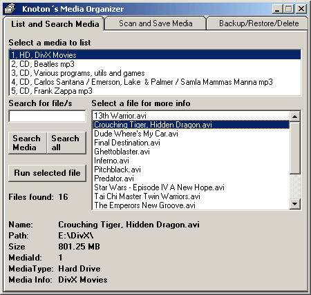



## Media Organizer

### Description

Have you ever wished your medias

such as CD-rom, Floppy, Hard drive

partition was better organized ?

My Media Organizer scans your media and returns information about

the files.

The result of the scan can be saved in an

Access Database (MS Access does not need to be installed) 

You can select what formats to scan for

from listboxes that lists the most common

formats of Videos, Audio, Picture,

Documents, Web and Executables.

You can also add your own defined formats.

Or choose to scan for all formats/files. 

You select on what drive your media is.

It can be a Floppy, CD-Rom, HD partition,

or mapped drive. 

When you open the program, it lists all current

medias on that database,It shows info such as: 

MediaId - Identification no to track the media 

MediaType - CD-Rom, Floppy, Hard Drive 

MediaInfo - Info, for ex collection of mp3. 

You select a media for a list of files. 

You select a file for additional info such as: 

MediaId, Mediatype, MediaInfo. 

Filename, Path, FileSize 

If the selected file is able to run

you can run it. for ex mp3 in default player. 

The database is searchable in several ways.

Search for .mp3 and you will get a list of all

mp3 on a media or on all medias.

The search function supports wildcards 

If something changes about the media you can do a

rescan of it. 

You can delete all medias or a specific media. 

You can backup the database and restore it. 

The projekt is made with VB 6.0 SP 5, MDAC 2.5. 

Please come with constructive feedbacks and bugreports. 
 
### More Info
 

             |
---                |---
**Submitted On**   |2001-08-01 10:38:24
**By**             |[Knoton](https://github.com/Planet-Source-Code/PSCIndex/blob/master/ByAuthor/knoton.md)
**Level**          |Intermediate
**User Rating**    |5.0 (15 globes from 3 users)
**Compatibility**  |VB 6\.0
**Category**       |[Complete Applications](https://github.com/Planet-Source-Code/PSCIndex/blob/master/ByCategory/complete-applications__1-27.md)
**World**          |[Visual Basic](https://github.com/Planet-Source-Code/PSCIndex/blob/master/ByWorld/visual-basic.md)
**Archive File**   |[Media Orga23854812001\.zip](https://github.com/Planet-Source-Code/knoton-media-organizer__1-25711/archive/master.zip)

